# Step 9 — Keyword Clustering & Mapping

**Date:** 2026-07-15  
**Source:** Step 2 (Content Inventory) + Step 8 (Keyword Expansion)

---

## 9.1 Overview

To maximize topical authority, the expanded keyword list is grouped into 5 distinct content clusters. Each cluster consists of a **Pillar Page** (the main commercial landing page) supported by **Subpages & Blog Posts** (informational or case studies).

---

## 9.2 The 5 Content Clusters

```mermaid
graph TD
    subgraph ClusterA ["Cluster A: AI & Automation"]
        A_Pillar["/services/automation-systems (Pillar)"]
        A_Blog1["/blog/how-we-reduced-onboarding-latency... (Existing)"]
        A_Blog2["/blog/whatsapp-automation-guide-for-indian-businesses (Proposed)"]
        A_Blog3["/blog/n8n-vs-make-for-business-automation (Proposed)"]
        A_Blog1 --> A_Pillar
        A_Blog2 --> A_Pillar
        A_Blog3 --> A_Pillar
    end

    subgraph ClusterB ["Cluster B: High-Performance Web Dev"]
        B_Pillar["/services/web-development (Pillar)"]
        B_Pillar2["/services/ecommerce-development (Proposed Gap)"]
        B_Case1["/work/riwaaz-ethnic (Case Study)"]
        B_Case2["/work/techflow-systems (Case Study)"]
        B_Blog1["/blog/why-headless-commerce-is-the-future... (Existing)"]
        B_Case1 --> B_Pillar
        B_Case2 --> B_Pillar
        B_Blog1 --> B_Pillar2
    end

    subgraph ClusterC ["Cluster C: Technical SEO"]
        C_Pillar["/services/technical-seo (Pillar)"]
        C_Blog1["/blog/demystifying-technical-seo... (Existing)"]
        C_Blog2["/blog/how-to-fix-lighthouse-lcp-score-nextjs (Proposed)"]
        C_Blog1 --> C_Pillar
        C_Blog2 --> C_Pillar
    end

    subgraph ClusterD ["Cluster D: Mobile App Dev"]
        D_Pillar["/services/mobile-app-development (Pillar)"]
        D_Blog1["/blog/react-native-vs-flutter-cost-comparison-india (Proposed)"]
        D_Blog1 --> D_Pillar
    end

    subgraph ClusterE ["Cluster E: Custom Software & ERP"]
        E_Pillar["/services/custom-software (Proposed Gap)"]
        E_Case1["/work/restaurant-management (Case Study)"]
        E_Case2["/work/lab2door (Case Study)"]
        E_Case1 --> E_Pillar
        E_Case2 --> E_Pillar
    end
```

---

## 9.3 Cluster Details & Internal Linking Schema

### Cluster A: AI & Workflow Automation (Priority 1 Moat)
- **Pillar Page:** `/services/automation-systems` (Existing)
  - *Keywords targeted:* `business workflow automation India`, `WhatsApp API integration services India`, `n8n agency India`, `Make.com partner India`.
- **Supporting Content:**
  - `how-we-reduced-onboarding-latency-by-80-percent-with-ai-agents` (Existing)
  - `/blog/whatsapp-automation-guide-for-indian-businesses` (Proposed)
  - `/blog/n8n-vs-make-for-business-automation` (Proposed)
- **Internal Linking Rule:** 
  - Every supporting blog post must link back to `/services/automation-systems` in the first 300 words using descriptive anchors like `"WhatsApp integration services"` or `"n8n business automation agency"`.
  - The Pillar page must have a dynamically rendered section linking to these 3 blog posts under an "Automation Insights" header.

### Cluster B: High-Performance Web Development (Priority 2)
- **Pillar Page 1:** `/services/web-development` (Existing)
  - *Keywords targeted:* `custom website development Ahmedabad`, `Next.js development agency India`, `outsource Next.js development India`.
- **Pillar Page 2:** `/services/ecommerce-development` (Proposed Content Gap)
  - *Keywords targeted:* `headless commerce agency India`, `Next.js Shopify integration developers India`, `headless e-commerce website cost India`.
- **Supporting Content:**
  - `/work/riwaaz-ethnic` (Case Study)
  - `/work/techflow-systems` (Case Study - needs sitemap re-indexing)
  - `/work/finserve-solutions` (Case Study - needs sitemap re-indexing)
  - `why-headless-commerce-is-the-future-for-ethnic-brands` (Existing blog)
- **Internal Linking Rule:**
  - Case studies must link to both the general `/services/web-development` page and the specific `/services/ecommerce-development` page.
  - The homepage (`/`) acts as a secondary pillar, linking directly to `/services/web-development` and `/work`.

### Cluster C: Technical SEO & Speed Optimization
- **Pillar Page:** `/services/technical-seo` (Existing)
  - *Keywords targeted:* `technical SEO services India`, `website speed optimization services Ahmedabad`, `Core Web Vitals consultant India`.
- **Supporting Content:**
  - `demystifying-technical-seo-why-lighthouse-score-isnt-everything` (Existing blog)
  - `/blog/how-to-fix-lighthouse-lcp-score-nextjs` (Proposed blog)
- **Internal Linking Rule:**
  - Blog posts must link back to `/services/technical-seo` using anchor `"technical SEO services"`.

### Cluster D: Mobile App Development
- **Pillar Page:** `/services/mobile-app-development` (Existing)
  - *Keywords targeted:* `mobile app development Ahmedabad`, `hire React Native developers India`.
- **Supporting Content:**
  - `/blog/react-native-vs-flutter-cost-comparison-india` (Proposed blog)
- **Internal Linking Rule:**
  - Proposed blog post must link back to `/services/mobile-app-development` using anchor `"mobile app development Ahmedabad"`.

### Cluster E: Custom Software & ERP (Verticals)
- **Pillar Page:** `/services/custom-software` (Proposed Content Gap)
  - *Keywords targeted:* `custom software development company Ahmedabad`, `node js custom dashboard developers India`.
- **Supporting Content:**
  - `/work/restaurant-management` (Case Study - POS)
  - `/work/lab2door` (Case Study - scheduling portal)
- **Internal Linking Rule:**
  - Both case studies must link to the new `/services/custom-software` landing page using anchor `"custom software development in Ahmedabad"`.
